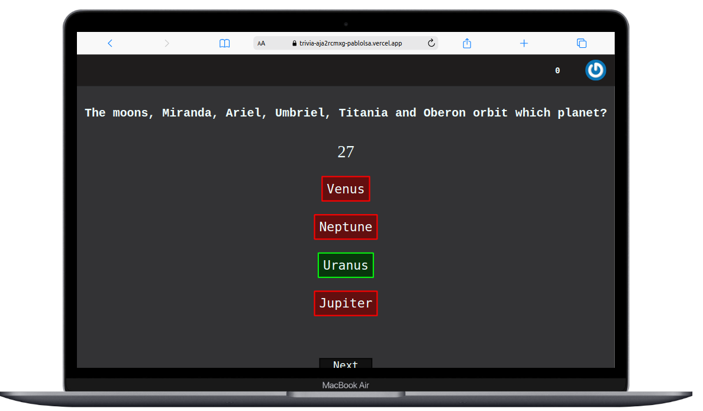

   

  ## Melhor contato 👇
  
    

 

## Desenvolvedor Front-end

Sou um desenvolvedor web apaixonado em busca constante de aprimoramento. Minhas maiores habilidades são CSS e React, e meu objetivo é me tornar um desenvolvedor Full-Stack até Novembro de 2023. A combinação do CSS para design e do React para componentes interativos me permite criar experiências incríveis. Estou sempre sedento por desafios e aprendizado contínuo, buscando oportunidades para expandir meus conhecimentos. Com dedicação e vontade de evoluir, estou confiante de que alcançarei meu objetivo e me tornarei um desenvolvedor web completo.
       
 
          
   
   ## 🌟 Github Stats
   
 

  <a href="https://github.com/PabloLSa">
  
    
    

       

### Ferramentas e tecnologias que utilizo:      
          
&nbsp;
&nbsp;
&nbsp;
&nbsp;
&nbsp;
&nbsp;
&nbsp;

&nbsp;
&nbsp;
&nbsp;
&nbsp;
&nbsp;
&nbsp;
&nbsp;
&nbsp;
&nbsp;

&nbsp;

&nbsp;
&nbsp;

 
 

<h1 align="center">Projetos</h1>

<table>
  <tr>
    <td valign="top" width="50%">
      <h2 align="center"><a href="https://github.com/PabloLSa/Trybe-Wallet">💸Wallet</a></h2>
      
       
       
      
<em><strong>💡Tecnologias utilizadas:</strong> React (redux, components), HTML, CSS Module e API Rest</em>

      
💰 Aplicação de conversão de moedas

    </td>
    <td valign="top" width="50%">
      <h2 align="center"><a href="https://github.com/PabloLSa/TrybeTunes">🔊 Tunes</a></h2>
      
       
      
<em><strong>💡Tecnologias utilizadas:</strong> React (router, components),CSS3,React-Bootstrap, </em>

      
🎶 Aplicação para ouvir pouco da melodia escolhida, som vem da API da Apple

    </td>
    </tr>
    <tr>
    <td valign="top" width="50%">
      <h2 align="center"><a href="https://github.com/PabloLSa/Trivia/">❓Trivia</a></h2>
      
       
      
<em><strong>💡Tecnologias utilizadas:</strong> React (react-redux, components),CSS</em>

      
🃏 Desenvolvemos um jogo de perguntas e respostas baseado no jogo Trivia, parecido um show do milhão americano, utilizando React e Redux.

    </td>
    </tr>
    <table>
     

