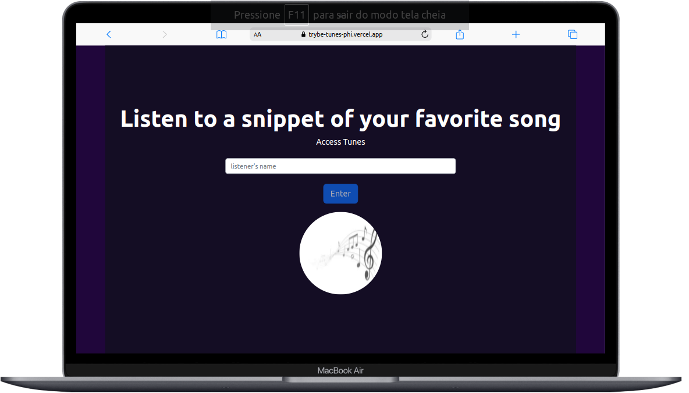

   

   
   ## 🌟 Github Stats
   
 

  <a href="https://github.com/PabloLSa">
  
    
    

       

  
  
### Desenvolvedor Front-end

Sou um desenvolvedor web, minhas maiores habilidades são CSS, e biblioteca React. Vivo na busca de me tornar um front-end cada vez melhor!! E estou caminhando para Full-Stack!!!
       
 
          
### Ferramentas e tecnologias que utilizo:      
          
         
 

     

          
          
           
    
 

          
       
  
 
<h2>
 

<h1 align="center">Projetos</h1>

<table>
  <tr>
    <td valign="top" width="50%">
      <h2 align="center"><a href="https://github.com/PabloLSa/Trybe-Wallet">💸Wallet</a></h2>
      
       
       
      
<em><strong>💡Tecnologias utilizadas:</strong> React (redux, components), HTML, CSS Module e API Rest</em>

      
💰 Aplicação de conversão de moedas

    </td>
    <td valign="top" width="50%">
      <h2 align="center"><a href="https://github.com/PabloLSa/TrybeTunes">🔊 Tunes</a></h2>
      
       
       
      
<em><strong>💡Tecnologias utilizadas:</strong> React (router, components),CSS3,React-Bootstrap, </em>

      
🎶 Aplicação para ouvir pouco da melodia escolhida, som vem da API da Apple

    </td>
  </tr>
  <tr>
    <table>
     
     

  
  ## Melhor contato
  <h1>👇</h1> 
  
  

<a align="right" href='https://www.linkedin.com/in/carloshtbraga/'>
</h2>

